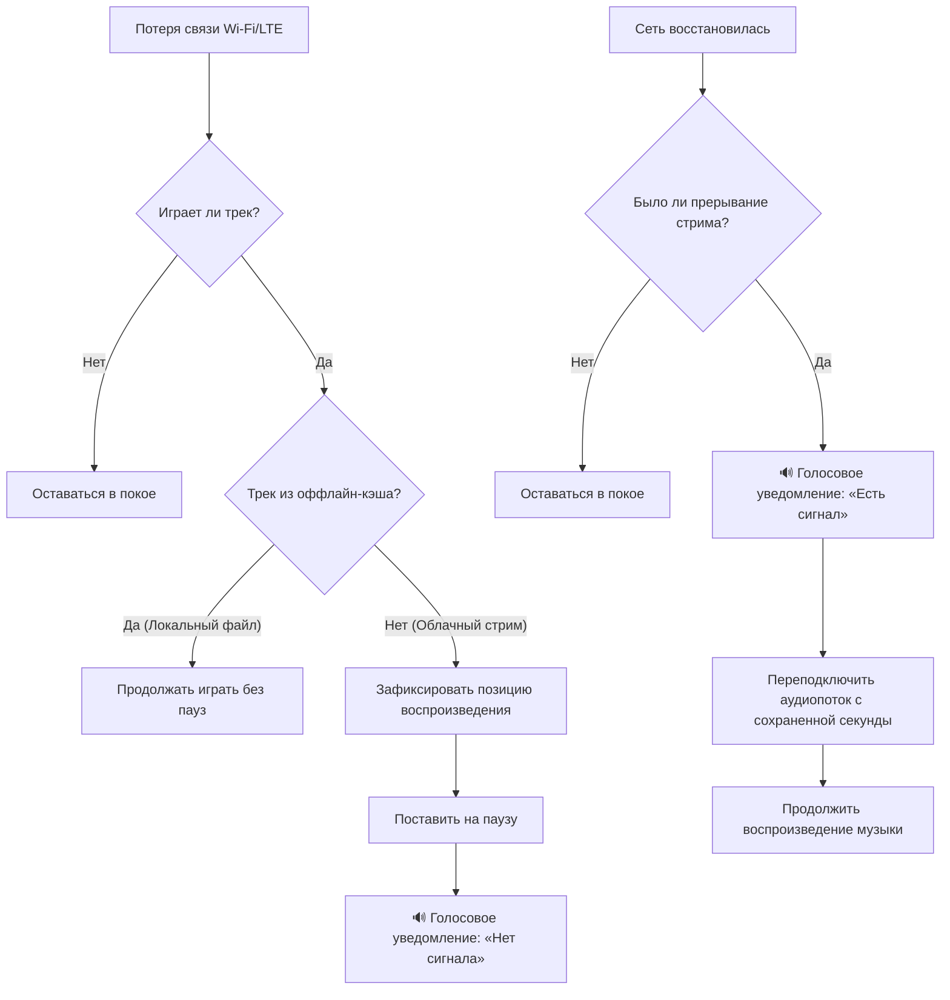
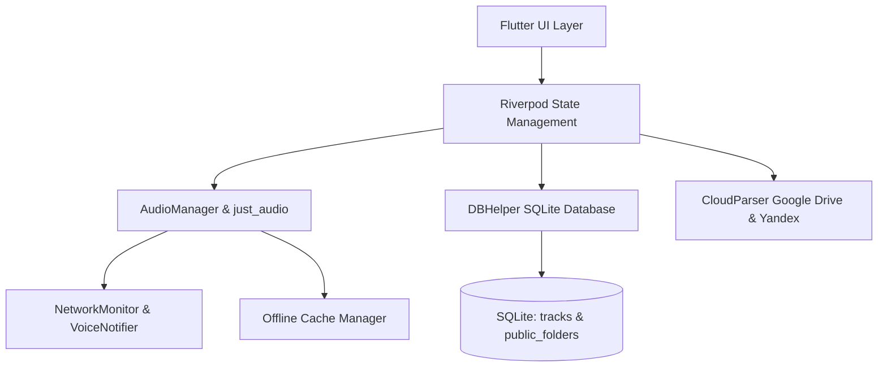

# 🎵 Cloud Music Player

<p align="center">
  <b>Персональный облачный плеер для Android и Desktop нового поколения.</b><br>
  Воспроизведение аудио напрямую из открытых папок Google Диска и Яндекс.Диска без подписок, рекламы, трекинга и авторизации.
</p>

<p align="center">
  <a href="https://github.com/bakan-off/cloud-music-player/releases"></a>
  <a href="https://flutter.dev"></a>
  <a href="https://dart.dev"></a>
  
  <a href="LICENSE"></a>
</p>

---

<p align="center">
  ⭐ <b>Понравился проект? Поставьте звезду на GitHub — это лучшая мотивация для развития плеера!</b> ⭐
</p>

---

## 📥 Скачать приложение

👉 **[Скачать установочный файл: cloud-music-player-v1.0.11.apk](https://github.com/bakan-off/cloud-music-player/releases/download/v1.0.11/cloud-music-player-v1.0.11.apk)**

> Все версии, changelog и предыдущие билды доступны в разделе **[GitHub Releases](https://github.com/bakan-off/cloud-music-player/releases)**.  
> Обновления на новые версии можно ставить **прямо из приложения в один клик** («Настройки» → «Обновление приложения»).

---

## 💡 Зачем нужен Cloud Music Player?

Зачем оплачивать ежемесячные подписки на стриминги (Spotify, Яндекс.Музыка, Apple Music), мириться с удалением любимых альбомов из каталогов или забивать гигабайты памяти телефона файлами по кабелю?

**Cloud Music Player** объединяет свободу личной аудиоколлекции и удобство облачного стриминга:
1. Загрузите свои треки (в любом качестве: MP3, FLAC, M4A, AAC) в любую открытую папку **Google Диска** или **Яндекс.Диска**.
2. Вставьте ссылку в плеер — и тысячи ваших треков мгновенно доступны для потокового прослушивания на смартфоне.
3. Никаких аккаунтов, паролей, регистрации или API-ключей. Приложение полностью бесплатно, не содержит рекламы и уважает приватность.

---

## 📊 Сравнение с популярными решениями

| Возможность | 🎵 Cloud Music Player | 🎧 Стриминговые сервисы (Spotify / Яндекс) | 📁 Локальные оффлайн-плееры |
|---|:---:|:---:|:---:|
| **Стоимость** | **Бесплатно навсегда, без рекламы** | Ежемесячная платная подписка | Бесплатно |
| **Собственная коллекция** | **Любые ваши треки и редкие релизы** | Только то, что разрешили правообладатели | Да |
| **Память телефона** | **Не тратится (чистый потоковый стрим)** | Кэш занимает гигабайты | Занимает всю память смартфона |
| **Оффлайн-режим** | **Кэширование в 1 клик** | Только с активной платной подпиской | Да |
| **Приватность** | **100% анонимно, без трекеров и аналитики** | Сбор истории, таргетинг и профилирование | Зависит от плеера |
| **Мульти-источники** | **Несколько папок Google/Яндекс одновременно** | Нет | Нет |
| **Рейтинг 1–5★** | **Интерактивные звезды прямо в плеере** | Только лайк/дизлайк | Редко |
| **Очистка 1★** | **Накопительное пакетное удаление нежелательных треков** | Нет | Нет |
| **Резервное копирование** | **Экспорт и импорт оценок в JSON** | Нет | Нет |
| **Голосовой ассистент сети** | **Озвучивание «Нет сигнала» / «Есть сигнал» и автовозобновление** | Ошибка / плеер зависает | Нет |
| **Встроенное автообновление** | **Проверка, скачивание и установка из GitHub** | Через Google Play Store | Редко |

---

## 🔥 Полный обзор возможностей

### ☁️ 1. Стриминг из облака без авторизации и API-ключей
- Поддержка открытых папок **Google Диска** и **Яндекс.Диска**.
- Работает с огромными коллекциями (800+ треков и больше).
- Мгновенное чтение структуры папки и прямой потоковый стрим без ожидания скачивания.

### 📂 2. Поддержка нескольких источников и облачных папок (Новинка v1.0.11)
- Добавляйте несколько независимых источников (например, «Любимый рок», «Хиты 2024», «Инструментал»).
- При добавлении можно задать собственное имя папки.
- Единая медиатека с возможностью быстрой фильтрации по источнику через чипы вверху экрана.
- Индивидуальная синхронизация и удаление папок с выбором, оставить ли треки в базе.

### 🔀 3. Гибкая сортировка и фильтр «Новые» (Новинка v1.0.11)
- **7 режимов сортировки медиатеки:**
  - ⏱️ *Сначала новые* (по дате добавления в библиотеку);
  - ⏳ *Сначала старые*;
  - 🔤 *По названию (А → Я)*;
  - 🔠 *По названию (Я → А)*;
  - 🎤 *По исполнителю (А → Я)*;
  - ⭐ *По рейтингу (сначала 5★)*;
  - ⏱️ *По длительности трека*.
- Выбор сортировки автоматически сохраняется между запусками приложения.
- Быстрый чип-фильтр **«Новые»** сразу отображает свежие поступления, позволяя быстро найти добавленные вчера композиции среди сотен файлов.

### 💾 4. Резервное копирование оценок: Экспорт и Импорт JSON (Новинка v1.0.11)
- Все выставленные вами рейтинги (звезды) можно экспортировать в читаемый JSON-формат.
- Копируйте данные в буфер обмена или сохраняйте в файл.
- При смене смартфона или переустановке приложения просто вставьте JSON обратно: плеер автоматически сопоставит треки по ID или связке «Название + Исполнитель» и восстановит все оценки!

### 🧹 5. Накопительная очистка треков 1★ в Настройках (Новинка v1.0.11)
- Во время случайного воспроизведения попался трек, который вам разонравился? Поставьте ему **1 звезду**.
- Баннер больше не мешает в медиатеке: треки с 1★ спокойно копятся.
- В **«Настройках»** появился блок очистки: он показывает общее количество треков с 1★, объем занимаемой ими памяти на диске в МБ и позволяет удалить их все в один клик.

### ✂️ 6. Автоматическая очистка названий треков (Новинка v1.0.11)
- Избавьтесь от файлового мусора в названиях: инструмент в один клик удаляет технические суффиксы (`.mp3`, `.flac`, `.m4a`), теги битрейта (`[320kbps]`), ютуб-пометки (`(Official Video)`, `(Lyric Video)`, `[Official Audio]`) и аккуратно заменяет нижние подчеркивания `_` на пробелы.

### 📜 7. Интерактивный быстрый скроллбар (Scrollbar)
- Плавная навигация по гигантским плейлистам на сотни и тысячи песен. Перемещайте ползунок пальцем, чтобы мгновенно оказаться в нужной части медиатеки.

### 📡 8. Голосовые уведомления о сети и умное автовозобновление
- **Интеллектуальный контроль соединения:** если вы слушаете стрим из облака и выходите из зоны действия Wi-Fi, плеер встает на паузу, сохраняет точную миллисекунду и произносит приятным голосом: *«Нет сигнала»*.
- **Автоматическое возобновление:** как только сигнал восстанавливается, звучит реплика: *«Есть сигнал»*, и воспроизведение мягко продолжается ровно с сохраненного места.
- **Оффлайн-треки играют непрерывно:** для локально закэшированных файлов голосовые алерты не включаются.
- В Настройках доступно тестирование реплик кнопками и переключатель функции.



### 🎨 9. 5 дизайнерских тем оформления
- 💜 **Фиолетовый обсидиан:** глубокий неоновый киберпанк (по умолчанию);
- 🌊 **Полуночный океан:** сапфирово-лазурная темная гамма;
- 🌿 **Изумрудный киберпанк:** контрастный мятно-неоновый стиль;
- 🌅 **Закатный янтарь:** теплая ламповая атмосфера винила;
- 🖤 **AMOLED Черный:** абсолютно черный фон `#000000` для максимального энергосбережения на OLED-экранах.

### 🔤 10. Настраиваемая типографика текста песен
- Выбирайте шрифт названий и исполнителей под свой вкус в меню «Настройки»:
  - 📱 **Компактный (Condensed)** (по умолчанию: узкий шрифт в стиле Spotify и Apple Music — длинные названия помещаются целиком);
  - ✨ **Современный** (элегантный чистый гротеск);
  - 📖 **Классический** (книжный стиль с засечками `serif`);
  - 📼 **Моноширинный** (ретро-эстетика винтажных студийных дек).

### 📱 11. Фоновое воспроизведение и системный мини-плеер
- Музыка **не засыпает** при выключенном экране и блокировке смартфона (встроенные `AudioService` + `WakeLock`).
- Интерактивный плеер в шторке уведомлений Android и на экране блокировки с обложкой, кнопками «Предыдущий», «Плей/Пауза», «Следующий» и шкалой перемотки.
- Поддержка кнопок управления на Bluetooth-наушниках и автомобильных магнитолах.

### 🔀 12. Честный Shuffle
- Алгоритм случайного перемешивания Фишера — Йетса без повторений и зацикливаний на одних и тех же треках.

### 🚀 13. Автообновление в один клик из GitHub
- Встроенный сервис проверяет свежие релизы на GitHub.
- Наглядный прогресс-бар загрузки APK и мгновенный вызов установщика Android.

---

## 🏗️ Архитектура приложения



### Структура исходного кода:
```
lib/
├── core/
│   ├── audio/           # just_audio плеер, очередь, честный shuffle, голосовой ассистент сети
│   ├── network/         # Мониторинг сети (Wi-Fi / сотовая связь)
│   ├── cloud/           # Парсер публичных ссылок Google Диска и Яндекс.Диска
│   ├── storage/         # SQLite база данных (таблицы tracks и public_folders)
│   └── update/          # Сервис автообновления через GitHub Releases API
├── models/
│   └── track.dart       # Модель трека (метаданные, streamUrl, cachePath, rating 1-5, folderUrl)
├── providers/
│   ├── library_provider.dart # Riverpod провайдер медиатеки, сортировки, фильтров и папок
│   ├── theme_provider.dart   # Провайдер тем оформления
│   └── font_provider.dart    # Провайдер типографики
├── ui/
│   ├── screens/
│   │   ├── main_navigation_screen.dart # Нижняя навигация и плавающий мини-плеер
│   │   ├── library_screen.dart         # Медиатека, поиск, сортировка, фильтры звезд и папок
│   │   ├── cached_screen.dart          # Оффлайн-треки и управление памятью
│   │   ├── import_screen.dart          # Добавление облачных папок и синхронизация
│   │   ├── settings_screen.dart        # Темы, шрифты, резервные копии, очистка 1★, обновления
│   │   └── player_screen.dart          # Полноэкранный плеер с винилом и рейтингом
│   ├── theme/
│   │   └── app_theme.dart              # Цветовые палитры и стили
│   └── widgets/
│       ├── mini_player.dart            # Сворачиваемый мини-плеер
│       └── star_rating_bar.dart        # Интерактивная шкала 5 звезд
└── main.dart
```

---

## 🛠️ Сборка из исходников

### Требования:
- **Flutter SDK**: 3.20+ (рекомендуется 3.24+)
- **Dart SDK**: 3.5+
- **Android SDK**: API 34+
- **Git**

### Инструкция:
```bash
# 1. Клонируйте репозиторий
git clone https://github.com/bakan-off/cloud-music-player.git
cd cloud-music-player

# 2. Установите зависимости
flutter pub get

# 3. Запустите автоматические тесты
flutter test

# 4. Соберите релизный APK
flutter build apk --release
```

Готовый файл APK будет находиться в `build/app/outputs/flutter-apk/app-release.apk`.

---

## 🤝 Вклад в развитие (Contributing)

Мы рады любым идеям, предложениям и улучшениям!
1. Сделайте **Fork** репозитория.
2. Создайте свою ветку (`git checkout -b feature/amazing-feature`).
3. Зафиксируйте изменения (`git commit -m 'Add amazing feature'`).
4. Отправьте изменения в ветку (`git push origin feature/amazing-feature`).
5. Откройте **Pull Request**.

---

## 🌟 Поддержите проект!

Если вам понравился **Cloud Music Player**, не забудьте:
- ⭐ **Поставить звезду репозиторию** на GitHub!
- 📢 Рассказать друзьям и поделиться ссылкой в социальных сетях.
- 💬 Оставить баг-репорт или идею новой фичи во вкладке **[Issues](https://github.com/bakan-off/cloud-music-player/issues)**.

---

## 📄 Лицензия

Проект распространяется под свободной лицензией **MIT**. Подробности в файле [LICENSE](LICENSE).
